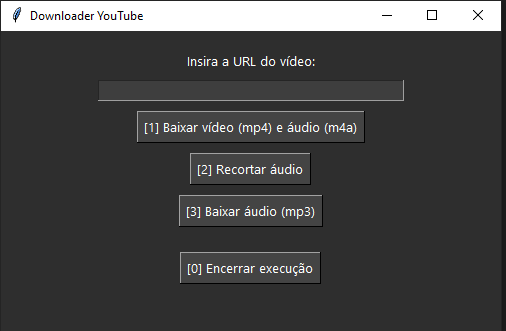
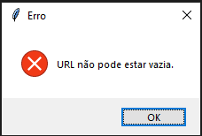
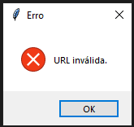

# Conversor de audio 

Projeto criado para solucionar e facilitar a conversão de vídeos `.mp4` e `.m4a` ou, se necessário `.wav`, para `.mp3`

## Index

- [Requerimentos](#requerimentos)
- [Modo de usar](#modo-de-usar)
    - [Tela inicial](#tela-inicial)
    - [Telas de erro](#telas-de-erro)
- [Instalação](#instalação)
    - [Instalação dependências](#instalação-dependências)
    - [Instalação FFMPEG](#instalação-ffmpeg)

## Requerimentos
- Python >= 3.13.3
    - pydub
    - pytubefix
- FFMPEG

Para execução é necessário o download do `FFMPEG` porque o `PYDUB` usa ele para conversão.

## Modo de usar

### Tela inicial

1. `Baixar vídeo (mp4) e áudio (m4a)` - Com uma url válida do youtube, baixa um aquivo de vídeo (mp4) e um de áudio (m4a) 
1. `Recortar áudio` - Recorta o arquivo `.mp3` da pasta `./assets/converted` e gera um novo com o tamanho novo informado.
1. `Baixar áudio (mp3)` - Com uma url válida do youtube, baixa um aquivo de vídeo (mp4) e um de áudio (m4a)
- `Encerrar execução`

### Telas de erro

Aparece quando seleciona a opção 1 ou 3 e o campo de url está vazio.

Aparece quando seleciona a opção 1 ou 3 e o campo de url foi preenchido com uma url que não é do youtube ou está incompleta.

## Instalação

### Instalação dependências

Instale as dependências do projeto com o `requirements.txt`

~~~python
pip install -r requirements.txt
~~~

ou instale manualmente todos

~~~python
pip install audioop-lts
pip install pydub
pip install pytubefix
~~~

### Instalação FFMPEG

Na raiz do projeto contém o arquivo [ffmpeg-2024-11-21-git-f298507323-essentials_build.zip](ffmpeg-2024-11-21-git-f298507323-essentials_build.zip) com os aquivos necessários.

Extrair todos para seu local de preferência.

> Recomendado adicionar o caminho da pasta `bin` as variáveis de ambiente do sistema PATH (no Windows) ou passar o caminho para o objeto instanciado.

## Gerar build do projeto

Instale as dependências de projeto com o `requirements_build.txt`

~~~python
pip install -r requirements_build.txt
~~~

ou instale manualmente

~~~python
pip install cx_Freeze
~~~

Na raiz do projeto o aquivo `setup.py` contêm as configurações necessárias para gerar o build do projeto.

No terminal execute o comando:
~~~python
python ./setup.py build
~~~

> O tempo de geração de geração do build pode variar de acordo com as configurações do hardware da máquina.

O arquivo final será gerado no caminho `./build/`
