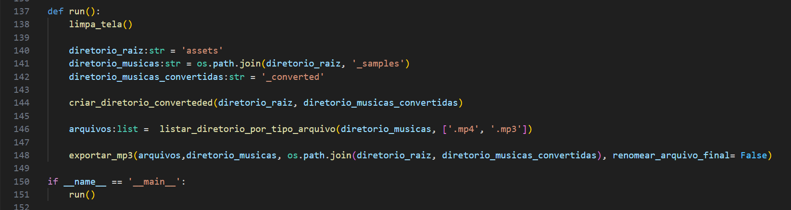

# Conversor de audio 

Projeto criado para solucionar e facilitar a conversão de audio de `.mp4` ou, se necessário `.wav`, para `.mp3`

## Index

- [Requerimentos](#requerimentos)
- [Requerimentos](#requerimentos)
- [Modo de usar](#modo-de-usar)

## Requerimentos

- FFMPEG
- pydub

Para execução é necessário o download do `FFMPEG` porque o `PYDUB` usa ele para conversão.

## Instalação FFMPEG

Na raiz do projeto contém o arquivo [ffmpeg-2024-11-21-git-f298507323-essentials_build.7z](ffmpeg-2024-11-21-git-f298507323-essentials_build.7z) com os aquivos necessários.

Extrair todos para seu locarl de preferência.

> Recomendado adicionar o caminho da pasta `bin` as variáveis de ambiente do sistema PATH (no Windows)

> Ou passar o caminho para o objeto instanciado.

## Modo de usar

<!-- - [convert_to_mp3.py](#convert_to_mp3.py) -->

### convert_to_mp3.py

Na função `run` que devem ser alterados são: 
- `diretorio_raiz` : usado para apontar o caminho do arquivo final convertido.
- `diretorio_musicas`: usado para apontar o caminho dos arquivos a serem convertidos.
- `diretorio_musicas_convertidas` : somente o nome da pasta onde os arquivos exportados seram salvos.

- se necessário os formatos dos arquivos que devem ser buscados na função `exportar_mp3` 

Exemplo, listando arquivo que tenham a extensão `.mp4`, `.mp3`:

      
